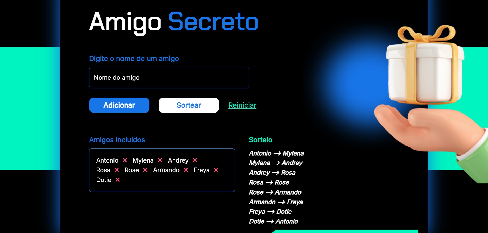

<h1>Sorteador de amigo secreto</h1>

<h2>🔖 Sobre</h2>

Projeto criado nos cursos de lógica de programação da Alura, de um sistema de sorteio de amigo secreto.

## 🚀 Tecnologias

  
  
  

## Projeto de aprendizado - Primeira implementação: 

Desenvolvida durante meus estudos iniciais de JavaScript, com foco em lógica, arrays, funções e manipulação do DOM.

## O que aprendi:
- JavaScript imperativo
- Manipulação direta de innerHTML
- Loops for
- Arrays
- Eventos
- DOM

[ Print da aplicação funcionando]

# Feito por

| [ Mylena Marques Ribeiro](https://github.com/MilyMarques) |
